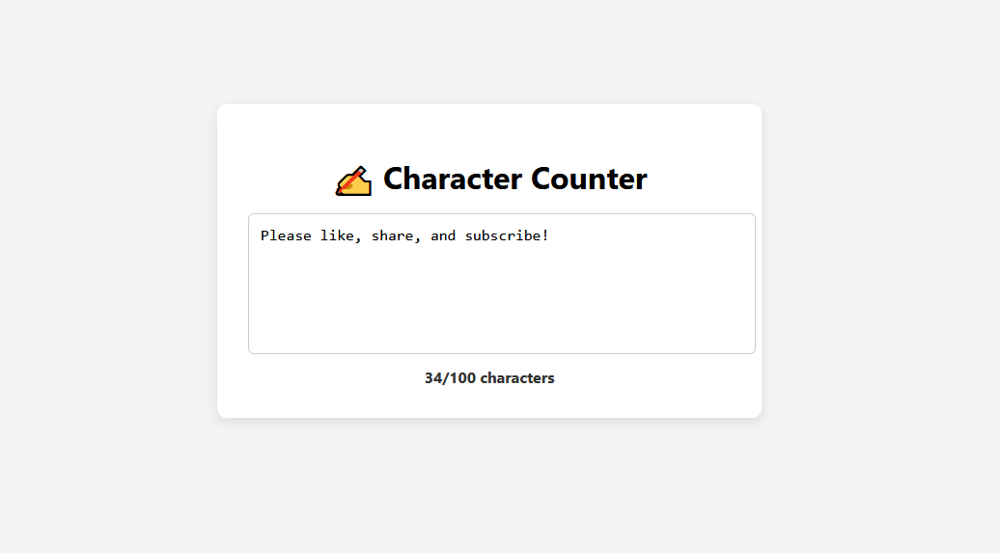

# ✍️ Real-Time Character Counter

A clean, responsive character counter built with HTML, CSS, and JavaScript. It updates live as you type, shows the total characters typed, and visually warns when the max limit is exceeded.

---

## 📑 Table of Contents

- [✍️ Real-Time Character Counter](#️-real-time-character-counter)
  - [📑 Table of Contents](#-table-of-contents)
  - [✨ Features](#-features)
  - [🖼 Preview](#-preview)
  - [📁 File Structure](#-file-structure)
  - [🌐 Live Demo](#-live-demo)
  - [⚙️ Installation](#️-installation)
  - [🚀 Usage](#-usage)
  - [🤝 Contributing](#-contributing)
  - [📬 Contact](#-contact)
  - [📄 License](#-license)

---

## ✨ Features

- 🔢 Live character count updates as you type
- 🚨 Visual warning when the character limit is exceeded
- 📱 Responsive and mobile-friendly layout
- 🧠 Built with pure HTML, CSS & JavaScript (no dependencies)

---

## 🖼 Preview



---

## 📁 File Structure

- `index.html`: Main HTML structure
- `styles.css`: Styles and responsive layout
- `script.js`: Real-time counter logic

---

## 🌐 Live Demo

🔗 [View Live Demo](https://codewithoyem.github.io/character-counter-100daysofcode/)

---

## ⚙️ Installation

1. Clone the repository:

   ```bash
   git clone https://github.com/codewithoyem/character-counter-100daysofcode.git
   cd digital-clock-dark-mode
   ```

2. Open the HTML file:

    `open index.html`

---

## 🚀 Usage

1. Start typing into the textarea.
2. Watch the character count update live.
3. The counter turns red when you exceed the max character limit (default: 100).

    To change the character limit, update this in index.html:

   ```bash
   <textarea maxlength="150"></textarea>
   ```

   And update the / characters text to match.

---

## 🤝 Contributing

Feel free to fork, improve, or customize!

1. Fork this repository
2. Create a new branch
3. Make your changes
4. Submit a Pull Request

---

## 📬 Contact

- Created by CODEWITHOYEM
- 📧 mailto:oyem@crisent.com
- 🌐 [oyem.crisent.com](https://oyem.crisent.com)
- 🐦 @codewithoyem

---

## 📄 License

This project is licensed under the MIT License and is available for use under the [MIT License](https://opensource.org/licenses/MIT).
